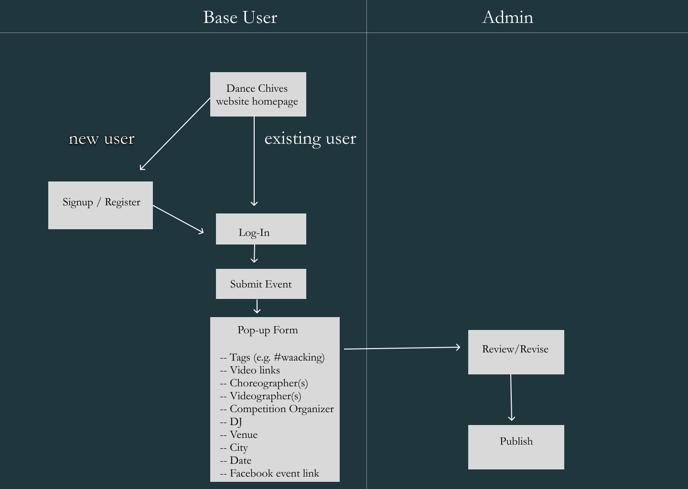

## Use Case for Dance Chives website

**Explain how dance competition metadata is entered by users and published by administrators**

(_NOTE: as no formal documentation exists, this was compiled from Discord messageboards_)

1. Identify Actors and Participants:
   
* Base User (Dancer, Spectator, Organizer, etc)
  
* Administrator (has “edit” permission for website)
  
2. Define Use Cases:
* Base User submits dance competition info
* Admin User reviews/publishes entry
3. Diagram Relationships:
* Show how Base User interacts with website to manually submit info
* Show how Admin User is involved in review and publication

**Figma Diagram**

